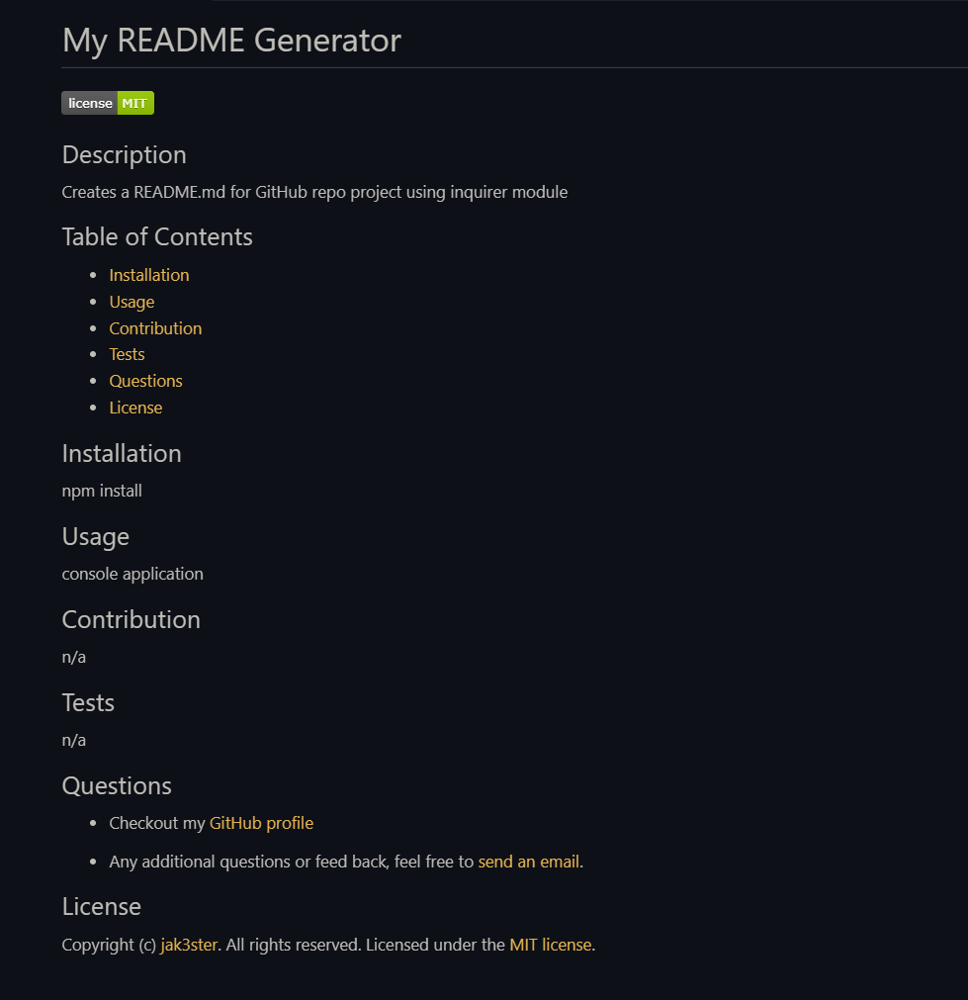

# My README Generator

A console application that dynamically generates a README.md file using inquirer module from a user's input. Allowing the project creator to quickly create a professional read me file for the project.

## Installation

1. Download or clone repository
2. Node.js is required to run the application
3. `npm install` to install the required npm packages

## Usage

* Application will be invoked by using the following command:
  
  `node index.js`

* The user is then prompted to answer questions regarding the README file.
* After all questions are answered, the title of the project and the following sections are generated:
  * Description
  * Table of Contents
    * With clicklable links to the corresponding sections
  * Installation
  * Usage
  * Contributing
  * Tests
  * Questions
    * Link to GitHub profile is added
    * Instruction on how to reach out with additional questions to email
  * License
    * a badge is added near the top after a license is picked from a list
  
* This is a sample [README](asset/demo/README.md) file for a project generated using this application
  
  
* [Video Demo](https://drive.google.com/file/d/1oVg7iEztIymnjsxM6tWezpePh1pqeRBD/view?usp=sharing)

## Features

* JavaScript
* Node.js
* npm

## License

Copyright (c) [jak3ster](https://github.com/jak3ster). All rights reserved.

Licensed under the [MIT license](LICENSE).
